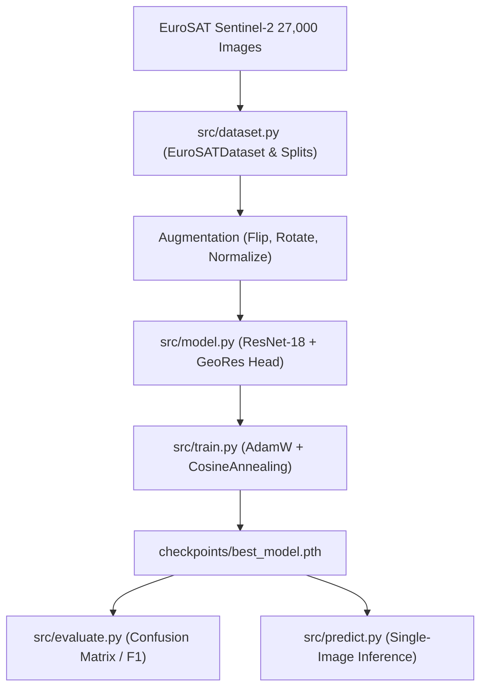

# Architecture

High-level system map: modules, services, data flow. Big picture only, no implementation detail.

## Overview
- **Project**: GeoRes (Smart India Hackathon 2026)
- **Domain**: Geospatial / Earth Observation / Remote Sensing Analysis
- **Core Dataset**: EuroSAT (Sentinel-2 satellite imagery)

## Components
- **Data Ingestion & Preprocessing** (`src/dataset.py`):
  - Ingestion: Reads EuroSAT Sentinel-2 patches (27,000 images, 10 classes) from `data/eurosat/Dataset`.
  - Splitting: Stratified 70/15/15 train/val/test splits.
  - Augmentation: Flips, rotations, normalization via PyTorch `torchvision.transforms`.
- **Model Architecture** (`src/model.py`):
  - Backbone: `ResNet-18` feature extractor with ImageNet initialization.
  - Head: Dropout + Linear projection layer mapping to 10 land cover classes.
  - Device: Auto-detected hardware acceleration (CUDA NVIDIA RTX 3050 / CPU).
- **Training Engine** (`src/train.py`):
  - Optimizer: AdamW with Cosine Annealing learning rate schedule.
  - Loss: CrossEntropyLoss.
  - Checkpointing: Automatically saves best validation checkpoint to `checkpoints/best_model.pth`.
- **Evaluation & Demonstration** (`src/evaluate.py`, `src/predict.py`):
  - Test set metrics (Precision, Recall, F1, Confusion Matrix).
  - Single-image inference with confidence score rankings.

## System Map

